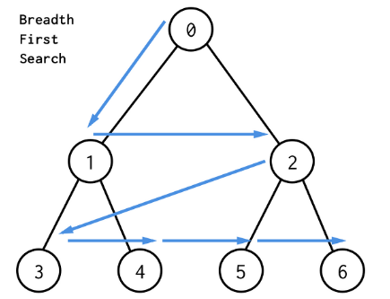

# Queue
## 특징
-  큐의 뒤에서 삽입만 하고, 큐의 앞에서는 삭제만 이루어지는 구조
- 선입선출구조(FIFO: First In First Out): 큐에 삽입한 순서대로 원소가 저장되어, 가장 먼저 삽입된 원소는 가장 먼저 삭제된다.
   

## 큐의 구조 및 기본연산
- 큐의 선입선출 구조
    - 머리(Front): 저장된 원소 중 가장 첫 원소 이전 원소
    - 꼬리(Rear): 저장된 원소 중 마지막 원소
- 큐의 기본 연산
    - 삽입: enQueue
    - 삭제: deQueue

## 큐의 주요연산
- `enQueue(item)` : 큐의 뒤쪽(rear 다음)에 원소를 삽입하는 연산
- `deQueue()` : 큐의 앞쪽(front)에서 원소를 삭제하고 반환하는 연산
- `createQueue()` : 공백 상태의 큐를 생성하는 연산
- `isEmpty()` : 큐가 공백상태인지를 확인하는 연산
- `isfull()` : 큐가 포화상태인지를 확인하는 연산
- `peek()` : 큐가 앞쪽(front)에서 원소를 삭제 없이 반환하는 연산

## 큐의 구현
### 1. 배열을 통한 구현 
#### 1. 선형큐 
- 생성 시에는 기본적으로 front, rear의 값을 -1로 한다.
- 생성 시 최대 크기와 원소의 타입을 지정해주어야 한다.
- 원소를 삽입하면 rear를, 삭제하면 front를 1 증가시킨다.

##### 코드 
###### 생성

``` java

public class Queue {
	String[] queue;
	int front;
	int rear;
    int length = 10;

    Queue(){ 
        this.front = -1;         
        this.rear = -1;          
        this.queue = new String[10];  // 자료형은 String, 배열의 크기는 10으로 설정
    }
}
```

###### 공백상태 확인

``` java
boolean isEmpty() {
		return front == rear; // front와 rear이 같다는 것이 원소가 없다는 것과 동일
}
```

###### 포화상태 확인

``` java
boolean isFull() {
	return rear == length - 1; // rear가 배열의 마지막 인덱스를 가리키면 포화상태
}
```

###### 삽입
- 삽입을 하기 전 배열이 차 있다면 크기를 1.5배한 배열을 생성하고 기존의 내용을 복사하여 채워넣는다.
- 새로운 배열의 크기를 온전히 쓰기 위하여 원소들을 맨 앞으로 끌어온다. 

``` java
void enQueue(String item) {
    if (isFull()) {           
        length = length*3/2;                        
        String[] arr = new String[length];                
        int l = size();
        System.arraycopy(queue,front+1,arr,0,l);     // arr의 0번 인덱스부터 요소를 l개 채우는데 queue의 front+1부터 채운다.
        queue = arr;
        front = -1;
        rear = l-1;
    }
    queue[++rear] = item;       // rear을 증가시키고 rear인덱스에 원소를 넣는다.
}
```

###### 삭제

``` java
String deQueue() {
	if (isEmpty()) {
		System.out.println("큐가 비어있습니다."); // 공백상태이면 삭제가 불가능
		return null;
	}
	return queue[++front];                      // 공백상태가 아니면 front+1에 있는 원소를 리턴하며 front를 1증가 시킴
                                                // 다시 앞의 원소에 접근하지 않으므로 초기화를 시킬 필요는 없음 
}
```

###### 삭제할 원소 조회

``` java
String peek() {
	if (isEmpty()) {
		System.out.println("큐가 비어있습니다."); // 공백상태이면 조회할 원소가 없음
		return null;
	}
	return queue[front + 1];                    // 공백상태가 아니면 front+1에 있는 원소를 반환
}
```
###### 큐의 데이터 크기

``` java
int size() {
	return rear - front; // front+1 ~ rear 에 원소들이 들어가므로 크기는 rear - front
}
```

##### 단점
- 잘못된 포화 상태 인식
    - rear=queue.length-1일 때 front가 어떤 값이든 포화 상태로 인식
    - 실제 쓰는 메모리의 양이 queue에 할당된 배열의 크기에 비해 매우 적을 수 있음

#### 2. 원형큐
- 선형큐의 단점을 보완하기 위해 원형으로 큐를 구현
- rear나 front가 끝에 도달하면 그 다음에 배열의 처음으로 돌아오는 방식을 사용
- 원소가 꽉찬 상태와 비어있는 상태를 구별하기 위하여 배열의 한 칸을 사용하지 않음(front인덱스 위치)

##### 코드
- 기본적으로 front와 end의 증감에 있어 queue.lengh에 대한 mod 연산이 들어간 것 외에 큰 차이가 없다.
- 하지만 queue의 포화 상태, 데이터 크기 계산에 있어 조심해야한다.
###### 생성

``` java

public class Queue {

	String[] arr;
	int front;
	int rear;
    int length;

    Queue(){ 
        this.front = -1;         
        this.rear = -1;          
        this.arr = new String[10];  // 자료형은 String, 배열의 크기는 10으로 설정
        this.length = 10; 
    }

}
```

###### 공백상태 확인

``` java
boolean isEmpty() {
	return front == rear; // front와 rear이 같다는 것이 원소가 없다는 것과 동일
}
```

###### 포화상태 확인

``` java
boolean isFull() {
	return rear == (front - 1+length)%length; // rear의 원소가 front 직전의 원소에 있는 경우 포화상태 (length를 더한 것은 java에서 음수를 자연수로 나누면 음수가 반환되기 때문)
}
```

###### 삽입

``` java
void enQueue(String item) {
	if (isFull()) {                                 
        String[] arr = new String[length*3/2];               
        int l = size();
        for(int i=0;i<l;i++){
            arr[i] = queue[(front+i+1)%length]; // 기존의 배열에서 복사를 할 때 front부터 순서대로 복사해야 하는데 중간에 배열의 맨 앞으로 갈 수도 있으므로 %연산으로 인덱스에 접근
        }    
        length = length*3/2; 
        queue = arr;
        front = -1;
        rear = l-1;
	}
    rear = (rear+1)%length;
	queue[rear] = item;       //  rear를 한칸 옮기고 rear인덱스에 넣음
}
```

###### 삭제

``` java
String deQueue() {
	if (isEmpty()) {
		System.out.println("큐가 비어있습니다."); // 공백상태이면 삭제가 불가능
		return null;
	}
    front = (front+1)%length;
	return queue[front];                      // 공백상태가 아니면 front를 한칸 옮기고 해당 front의 원소를 반환함
                                                // 다시 이 공간을 사용할 때는 데이터를 덮으며 들어오기에 초기화를 시킬 필요는 없음 
}
```

###### 삭제할 원소 조회

``` java
String Qpeek() {
	if (isEmpty()) {
		System.out.println("큐가 비어있습니다."); // 공백상태이면 조회할 원소가 없음
		return null;
	}
	return queue[(front + 1)%length];                    // 공백상태가 아니면 front+1에 있는 원소를 반환
}
```
###### 큐의 데이터 크기

``` java
int size() {
	return (rear - front+length)%length; // (front+1)%length ~ rear 에 원소들이 들어가므로 크기는 (rear - front+length)%length
}
```

### 2. LinkedList를 통한 구현
- 첫 원소에서의 삭제, 마지막 원소에서의 삽입이 일어나므로 DLL(Doubly LinkedList)을 이용하여 구현한다.
- 기본적으로 DLL의 구조와 동일하나 끝에서의 삭제의 경우 tail 노드를 통해 접근하기에 빠르다.

#### 코드
##### 생성

``` java
class Node {
	String data;     // 데이터 필드 (String)
	Node prev;    // 앞의 노드와 연결
	Node next;    // 뒤의 노드와 연결
}

public class Queue {
	Node head;	  // front
	Node tail;	  // rear+1
	int size;	  // 데이터의 크기
	Queue(){
		this.head = new Node();
		this.tail = new Node();
		this.size = 0;
		head.next = tail; 		// 초기에는 head와 tail을 연결해 준다.
		tail.prev = head;
	}
}
```

##### 공백상태 확인

``` java
boolean isEmpty() {
		return size==0;
}
```

##### 삽입

``` java
void enQueue(String item) {
		Node new_node = new Node();		// 새 노드 생성
		new_node.data = item;			
		Node cur = tail.prev;			// cur: tail의 앞의 노드 
		new_node.next = tail;			// 먼저 새 노드의 next, prev을 채우고
		new_node.prev = cur;
		tail.prev = new_node;			// tail의 prev를 먼저 바꾸고 
		cur.next = new_node;			// cur의 next를 바꾼다.
		size+=1;
}
```

##### 삭제

```java
String deQueue() {
		if(isEmpty()) {
			return "비어있음";				// 비어 있으면 삭제 못함
		}
		String str = head.next.data;	// str: 반환할 데이터 값
		head.next = head.next.next;		// head를 head.next.next에 연결시 자동으로 head.next에 있던 도느의 연결이 끊어짐
		size-=1;
		return str;
}
```

##### 삭제할 원소 조회

```java
String peek() {						// 비어 있으면 조회 불가
		if(isEmpty()) {
			return "비어있음";
		}
		String str = head.next.data;
		return str;
}
```

##### 데이터 크기

``` java
int size() {
		return size; 
}
```

#### 장점
- 배열로 구현한 큐와 달리 필요한 만큼만 크기를 할당하여 효율적인 메모리 사용이 가능하다.

## 자바에서의 큐
- 큐는 인터페이스이고 구현체는 주로 LinkedList를 사용한다.

|명령어|기능|
|---|---|
|`add(E e)`|데이터 추가, 추가될 수 없으면 예외 발생|
|`boolean offer(E e)`|데이터를 추가, 추가될 수 없으면 false, 되면 true 리턴|
 `E peek()`|가장 앞에 있는 데이터 조회, 데이터 없으면 null|
| `E element()`|가장 앞에 있는 데이터 조회, 데이터 없으면 예외 발생|
|`E remove()`| 가장 앞에 있는 데이터 빼내기, 삭제할 수 없으면 예외 발생|
|`E poll()`|가장 앞에 있는 데이터 빼내기, 삭제할 수 없으면 return null;|
|`boolean isEmpty()`|큐가 비어 있는지 여부|

## 큐의 활용
- 프린터 큐
    - 문서의 중요도가 주어져 있을 때 어떤 것을 먼저 출력할 것인가?
    - [프린터 큐](https://www.acmicpc.net/problem/1966)
- BFS 
    - 너비 우선 탐색으로 가까운 곳부터 탐색하는 탐색 방식



# Deque
## 특징
- Double-ended-queue의 줄임말로 양방향에서 데이터를 처리할 수 있는 queue형 자료구조

## 덱의 구현
### 1. 배열을 통한 구현
- 기본적으로 배열로 원형큐를 구현하는 것과 유사하나 앞에 요소 추가, 뒤의 요소 삭제가 추가된다. 

#### 맨 앞에 삽입

``` java
void addFirst(String item) {
    	if (isFull()) {           
            length = length*3/2;                        
            String[] arr = new String[length];                
            int l = size();
            System.arraycopy(deque,front+1,arr,0,l);     // arr의 0번 인덱스부터 요소를 l개 채우는데 queue의 front+1부터 채운다.
            deque = arr;
            front = -1;	
            rear = l-1;
    	}
    	deque[front] = item;							// front에 원소를 삽입하고
    	front = (front-1+length)%length;				// front를 앞으로 한 칸 이동
    }
```

#### 맨 뒤의 원소 삭제

``` java
String removeLast() {
    	if (isEmpty()) {
    		System.out.println("큐가 비어있습니다."); // 공백상태이면 삭제가 불가능
    		return null;
    	}
    	String str = deque[rear];					// 반환할 값을 저장
        rear = (rear-1+length)%length;				// rear을 앞으로 한 칸 옮김
    	return str; 
    }
```

### 2. LinkedList를 통한 구현
- 이 역시 LinkedList를 통해 구현한 queue에 두 가지 연산만 추가 하면 된다.

#### 맨 앞에 삽입

``` java
void addFirst(String item) {
		Node new_node = new Node();					// 새 노드 생성
		new_node.data = item;						
		Node cur = head.next;						// cur은 head의 다음, 즉 첫 번째 원소
		new_node.next = cur;						// new_node의 연결 상태를 먼저 설정하고
		new_node.prev = head;	
		head.next = new_node;						// head의 next와
		cur.prev = new_node;						// cur의 prev를 new_node로 설정
}
```

#### 맨 뒤의 원소 삭제

``` java
String removeLast() {
		if(isEmpty()) {
			return "비어있음";				// 비어 있으면 삭제 못함
		}
		String str = tail.prev.data;	// str: 반환할 데이터 값
		tail.prev = tail.prev.prev;		// tail을 tail.prev.prev에 연결시 자동으로 head.prev에 있던 노드의 연결이 끊어짐
		size-=1;
		return str;
}
```

## 자바에서의 deque
- deque는 인터페이스이고 구현체는 주로 ArrayDeque와 LinkedList를 사용한다.

|명령어|기능|
|---|---|
|`addFirst(E e)`|맨 앞에 데이터를 추가|
|`addLast(E e)`|맨 뒤에 데이터 추가|
| `E removeFirst()`|가장 앞에 있는 데이터 제거|
|`E removeLast()`|가장 뒤에 있는 데이터 제거|
|`E peekFirst()`| 가장 앞에 있는 데이터 조회|
|`E peekLast()`|가장 뒤에 있는 데이터 조회|
| `boolean ifEmpty()`|덱이 비어 있는지 여부|

## deque의 활용
- 주로 데이터의 좌우에서 모두 삽입과 삭제가 필요할 때 사용하나, 그냥 큐나 스택이 필요할 때 덱을 가져와도 상관없다.
	- [AC](https://www.acmicpc.net/problem/5430)
- 베열을 회전 (원형으로 생각하였을 때 시계/ 반시계방향)
    - [특이한 자석](https://swexpertacademy.com/main/code/problem/problemDetail.do?contestProbId=AWIeV9sKkcoDFAVH)
    - 배열을 오른쪽으로 회전시키는 방법: 가장 오른쪽의 요소를 빼서 가장 왼쪽에 넣는다.
    - 배열을 왼쪽으로 회전시키는 방법: 가장 왼쪽의 요소를 빼서 가장 오른쪽에 넣는다.